<h3><code>akshat@github ~ $ ./contributions.sh</code></h3>

 
 

<h3><code>akshat@github ~ $ whoami</code></h3>

<table>
<tr>
<td valign="top"></td>
<td valign="top"></td>
</tr>
</table>

[portfolio](https://www.akshatmahajan.in/about) &nbsp;·&nbsp;
[linkedin](https://www.linkedin.com/in/akshatmhjj/) &nbsp;·&nbsp;
[email](mailto:akshatmahajan32@gmail.com)

> Software engineer building fast, reliable web and iOS products. 
> Modular systems, responsive interfaces, and performance that holds up.

I work across React.js, Node.js, Swift, and SwiftUI, with a focus on modular 
architecture, API performance, and polished user experiences. I enjoy turning complex 
product requirements into maintainable systems that scale.

<samp>javascript &nbsp; react &nbsp; node.js &nbsp; swift &nbsp; swiftui &nbsp; express.js &nbsp; postgresql &nbsp; mongodb &nbsp; redis &nbsp; docker &nbsp; git &nbsp; github actions</samp>

**[Code Journey](https://www.codejourney.space/)** &nbsp;·&nbsp; <samp>next.js, typescript, supabase, tailwind css</samp> 
A free, role-based map for tech careers, with an AI guide that answers from its own content. 
10 roles and roughly 100 ordered skills, built on Next.js and TypeScript, and installable as a PWA.

**[Predicteye](https://predictye.com/)** &nbsp;·&nbsp; <samp>rest APIs, machine learning, system design</samp> 
Predictive ML platform connecting a real-time frontend to stateless REST APIs, 
delivering sub-200ms p95 latency with horizontally scalable services.

**[Shortify](https://url-shortener-navy-eta.vercel.app/)** &nbsp;·&nbsp; <samp>react.js, node.js, postgresql, redis, docker</samp> 
Production-grade URL shortener with Base62 codes, Redis cache-aside, analytics, 
rate limiting, and sub-100ms redirects at scale.

**[iOS SDK work](https://www.linkedin.com/in/akshatmhjj/)** &nbsp;·&nbsp; <samp>swift, swiftui, mvvm</samp> 
Modular SDK architecture and optimized API integration, using concurrency, 
request batching, and caching to reduce end-to-end latency.

